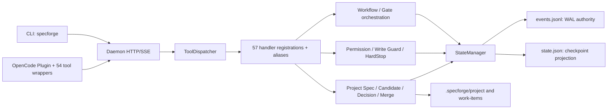
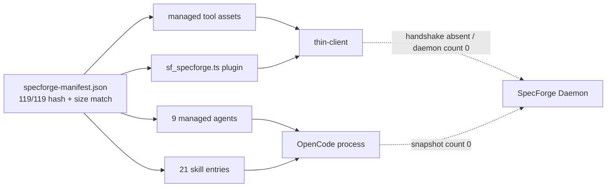

# SpecForge 当前发布真实架构与模块使用清单

## 1. 文件职责与证据边界

本文是 `current-release-boundary-and-module-convergence-plan.md` Step 1 的只读证据快照，回答“当前 HEAD 的源码实际上实现了什么、当前用户级现场实际上部署并运行了什么”。

本文不是产品范围或产品架构权威，不替代 V6 `requirements.md`、V6 `design.md` 或 ADR-013，也不授权删除模块。本文中的模块分类是 Step 1 发现分类；最终 `KEEP / ENABLE / REMOVE / HISTORICAL_ONLY` 只能在 Step 2–5 完成后冻结。

```text
EVIDENCE_DATE=2026-08-26
BASELINE_BRANCH=main
BASELINE_HEAD=45a0cfee54306a3f29a8ca06dfa827b385b25e50
REMOTE_BASELINE=origin/main@45a0cfee54306a3f29a8ca06dfa827b385b25e50
WORKTREE=DIRTY_PRESERVED_EXISTING_PATCH_SET
STAGED_CHANGES=NONE
EXPERIENCE_FILE_READ=YES
APPLICABLE_EXPERIENCE_RULES=EXP-001,EXP-002,EXP-004,EXP-007,EXP-008,EXP-017,EXP-018,EXP-019,EXP-033,EXP-038,EXP-040,EXP-046,EXP-060,EXP-065,EXP-086,EXP-087
REPEATED_ERROR_CHECK=PASS
PRIOR_FAILURE_RECONCILIATION=PASS
BACKFILLED_ERROR_IDS=ERR-892,ERR-893,ERR-894,ERR-895,ERR-896,ERR-897,ERR-898,ERR-899,ERR-900,ERR-901
UNRECORDED_FAILURES=0
PRODUCT_CODE_CHANGED=NO
MODULE_REMOVAL=NOT_PERFORMED
```

证据强度含义：

- `CONFIRMED`：当前源码、Git、manifest 或成功的现场快照直接证明；
- `CORROBORATED`：至少两类独立证据一致，但仍包含有限的可达性解释；
- `INSUFFICIENT_EVIDENCE`：不能形成最终去留结论。

## 2. 最重要的实际结论

当前必须同时区分三个层面：

| 层面 | 当前事实 | 结论 |
|---|---|---|
| V6 设计目标 | 独立 Daemon 是唯一运行时真相源，CLI 与 Thin Plugin 通过 HTTP/SSE 接入 | 是目标权威，但内部仍有发布边界冲突，等待 Step 2–3 修订 |
| 仓库源码实现 | 已有 Daemon、HTTP、Tool Dispatcher、57 个 handler 注册、Workflow、Permission、WAL/State、Gate 和治理产物链 | 主体能力已构建，但服务二进制生产和部署闭环缺失 |
| 当前用户级现场 | manifest 管理的 119 个文件完整；实际部署 Agents、Skills、Tools 和 Plugin；`sf-user/bin` 为空，无 handshake，无运行中的 daemon/OpenCode | 当前现场不是 V6 设计描述的可运行独立 Daemon 发布形态 |

因此，“主体能力完成”只能说明仓库中存在主要业务实现，不能证明它已经成为可安装、可启动、可回归、可发布的同一个产品。

## 3. 实际架构图

### 3.1 仓库源码已经实现的主链路



主链路的源码入口与职责：

1. `packages/daemon-core/src/index.ts` 可直接启动 Daemon，但 package 没有 `bin`；
2. `Daemon` 组装 HTTPServer、ToolDispatcher、EventBus、StateManager、ProjectManager、WorkflowEngine、PermissionEngine 与 ExtensionLoader；
3. `packages/daemon-core/src/tools/index.ts` 通过副作用 import 注册 handler；当前源码有 57 个 `registerHandler(...)` 调用；
4. 用户级 54 个顶层 Tool 文件统一通过 `tools/lib/thin-client.ts` 请求 Daemon；
5. Gate、Candidate、Project Spec、Audit 等治理实现位于 daemon-core handler/lib 层。

### 3.2 当前实际用户级部署与运行快照



现场证据：

- `C:\Users\lyq\.config\opencode\specforge-manifest.json` 存在，119 个清单文件全部存在且大小、SHA256 匹配；
- live `opencode.json` 注册 9 个 SpecForge Agent 和 `./plugins/sf_specforge.ts`；
- `sf-user/bin` 存在但为空，未发现 `specforged.exe` 或 `specforged`；
- 未发现 `sf-user/runtime/handshake.json`；
- 成功且可解析的 341 进程快照中，精确匹配的 SpecForge daemon 为 0，`opencode.exe` 为 0；
- live 119 个受管文件与当前 setup 源比较为 118 个完全相同、1 个差异；差异是当前工作区尚未部署的 `plugins/sf_specforge.ts` 修改。

这只是 2026-08-26 的现场快照，不证明 daemon 在其他时间从未运行。

## 4. package 实际依赖关系

### 4.1 构建集合

`packages/` 共有 16 个 package，根构建脚本全部构建：

```text
types
version-unification
configuration
service-management
host-profile
self-healing
multimodal
observability
permission-engine
opencode-adapter
migration
scope-gate
workflow-runtime
plugin-loader
cli
daemon-core
```

“被构建”不等于“被当前生产入口调用或部署”。

### 4.2 生产 TypeScript AST import/export 边

本次分析排除 tests、examples 与 dist，对 603 个生产 TypeScript 文件做 AST import/export/dynamic-import 解析；只把正式语法边计入依赖，不把注释和普通字符串计为调用。

| 调用 package | 实际源码依赖 |
|---|---|
| `cli` | `types`、`version-unification`、`configuration`、`service-management` |
| `configuration` | `types` |
| `daemon-core` | `types`、`configuration`、`permission-engine`、`workflow-runtime`、`service-management`、`observability`、`plugin-loader`、`host-profile`、`version-unification`、`migration` |
| `host-profile` | `types` |
| `migration` | `types` |
| `permission-engine` | `types`、`observability` |
| `plugin-loader` | `types`、`observability` |
| `service-management` | `types` |
| `version-unification` | 无 package 依赖；只从仓库根 `package.json` 读取代码版本 |
| `workflow-runtime` | `types`、`daemon-core` |

没有生产 AST 调用边的 package：`self-healing`、`multimodal`、`opencode-adapter`、`scope-gate`。`migration` 已由 `daemon-core/ProjectManager.registerProject()` 在首次项目写入前调用 per-file schema precheck；installer consumer 与其他 owner descriptors 尚未完成。

manifest 声明依赖比实际 AST 边更宽，并包含 `daemon-core ↔ service-management` 等声明级循环；`workflow-runtime → daemon-core` 与 `daemon-core → workflow-runtime` 形成源码级双向依赖。该差异是 Step 3/6 需要治理的依赖债务，不在 Step 1 直接修改。

## 5. 状态、数据与治理产物权威

| 对象 | 当前权威生产者 | 权威/投影关系 | 路径或输出 |
|---|---|---|---|
| 项目 Runtime 事件 | `StateManager` → `WAL` | owner validator 后 append+fsync，是恢复权威；空/损坏 WAL fail closed | `<project>/.specforge/runtime/events.jsonl@1.0` |
| 项目 Runtime 状态 | `StateManager` | WAL 重放后的 checkpoint 投影；共享 `schema_version=1.0` serializer，带 stateVersion 并发控制 | `<project>/.specforge/runtime/state.json@1.0` |
| daemon 全局状态 | daemon `StateManager` | 仍存在，但 path-resolver 已把相关 API 标为 deprecated | 用户级 `sf-user/runtime/state.json` 与 `events.jsonl` |
| 连接握手 | `HandshakeManager` | daemon 实例拥有的临时连接事实 | 用户级 `sf-user/runtime/handshake.json` |
| Project Spec / project policy | `ensureProjectInit` + governed Project Spec merge 是唯一 Project Spec 生产链；Observability owner 定义唯一三档 policy 合同 | `spec_manifest.json@1.0`、`extension_registry.json@1.0` 与 `observability.json@1.0` 均在 Runtime 创建前由 owner descriptor 校验 | `.specforge/project/**`、`.specforge/config/observability.json`、`versions/spec_versions.jsonl` |
| Project module identity | `spec_manifest.modules[]` 是模块枚举权威；ProjectManager 动态生成逐模块 descriptor，controlled Writer、Gate、Merge Runner 使用相同版本化候选合同 | `schema_version=1.0` + 精确 canonical `module_code`；旧身份字段、重复/错配路径、缺失模块均在 Runtime 创建前 fail closed | `.specforge/project/modules/<MODULE>/module.json` |
| Inert risk policy | 无生产 reader；此前只有 layout key 与 bootstrap 空文件 | `BUILT_NOT_ENABLED` 且无启用计划，已从当前 layout/init/projection 删除 | 历史文档仅作证据，不进入发布 |
| Work Item | lifecycle handler/lib + StateManager | `work_item.json` 是 WI 投影，状态推进必须走 Runtime | `.specforge/work-items/<WI>/work_item.json` |
| Candidate | Candidate prepare/freeze transaction | `candidate_manifest.json` 在 prepared 前冻结，Gate/Decision/Merge 消费冻结字节 | `.specforge/work-items/<WI>/candidate_manifest.json` 与 candidates |
| Gate Attempt | `gate-chain.ts` | `gate_attempts/attempt-NNNN` 使用 exclusive write，保存不可变 Attempt；`gates/` 是 latest 兼容视图 | `.specforge/work-items/<WI>/gate_attempts/**` |
| User Decision | `user-decision-recorder-v11.ts` | 唯一正式写入者 | `.specforge/work-items/<WI>/user_decision.json` |
| Changed Files Audit 输入 | Write Guard append-only log | 实际允许/阻断写入的事实源，不接受调用者自报替代 | `.specforge/work-items/<WI>/write_guard_log.jsonl` |
| Verification Evidence | verification evidence producer | verification report 与 evidence manifest | `.specforge/work-items/<WI>/evidence/**` |

持久化文件的实际 owner、首次读写边界、schema 证据与冲突状态单独维护在
[current-release-persistent-file-owner-inventory.md](./current-release-persistent-file-owner-inventory.md)。该清单是实现证据目录，不替代 V6 requirements/design 或 owner 导出的 descriptor。

当前注册边界：`ProjectManager.registerProject()` 已拒绝旧 `.specforge/manifest.json`，仅接受 `.specforge/project/spec_manifest.json`，并在创建 Runtime 目录前校验 Project Spec、由 manifest 动态枚举的全部 Module Identity、Project Config、Project Registry 与 Observability policy；Runtime checkpoint/WAL 在 `StateManager.initialize()` 的更紧边界校验。静态 descriptor 为 6 个，实际项目有效数量为 `6 + PROJECT_MODULE_COUNT`。剩余持久化 owner 覆盖受上述 inventory 中的合同冲突或 consumer disposition 阻断。

## 6. 动态 registry、Workflow 与插件边界

| 责任面 | 当前事实 | 证据结论 |
|---|---|---|
| Tool registry | 57 个生产 `registerHandler()`；54 个用户级顶层 tool wrapper；另有 v1.1 alias 映射 | 核心 handler 链已实现，wrapper/alias 映射需在 Step 3 固化为设计 |
| Workflow | repo `configs/workflows/builtin` 有 11 个 JSON；ExtensionLoader 搜索用户级、cwd 和 repo-relative 路径 | 源码开发树可加载；当前用户级 manifest 未部署该目录，release artifact 闭环缺失 |
| Plugin loading | Daemon 创建 ExtensionLoader 时关闭 plugin、开启 skill/tool/workflow/gate | `plugin-loader` 框架存在，第三方 plugin runtime 当前未启用 |
| Skill/Tool/Gate extension loader | 实现中仍有 TODO，并返回 `loaded: true` 占位 | 不能把“loaded=true”解释为真实动态注册完成 |
| OpenCode plugin | 动态加载 `sf_plugin_client.ts`；同时本地 shadow `write/edit/apply_patch` 并实现大量 Write Guard 逻辑 | 当前 plugin 不是 V6 design 所说的“只报告事件的极薄插件” |
| Scope Gate | CLI 使用本地 `scope-gate-bridge.ts` 直接解析 V6 requirements，不 import `@specforge/scope-gate` | scope-gate package 本体当前无生产调用；CLI 中存在重复简化解析器 |

## 7. 模块证据卡全集

Step 1 的停止条件要求：证据不足时不得虚构最终 `DISPOSITION`。因此下表的 `建议动作` 只是进入 Step 2–5 的输入；`NOT_FROZEN` 表示尚未形成最终去留授权。

| MODULE_ID | BUSINESS_CAPABILITY | PACKAGE_OR_PATH / PRODUCTION_ENTRY / DIRECT_CALLERS | STATE_AUTHORITY / DATA_INPUT_OUTPUT | DEPLOYMENT_ENTRY / RUNTIME_ENABLEMENT | TEST/GOVERNANCE/LEGACY | CLASSIFICATION / EVIDENCE / 建议动作 |
|---|---|---|---|---|---|---|
| `PKG-TYPES` | 共享合同、状态和路径类型 | `packages/types`; 被 9 个 package import | 不持久化；定义共享合同 | 无独立进程；源码活跃 | 广泛测试；V6 shared contracts；含少量旧布局消费者 | `CURRENT_RELEASE_SUPPORTING / CONFIRMED / KEEP` |
| `PKG-DAEMON` | 核心治理运行时、HTTP、Tool、State、Gate | `daemon-core/src/index.ts`、`Daemon`; CLI/OpenCode 应调用 | 拥有 Runtime、WAL、Tool/Gate 执行 | 无 package bin；live 无二进制/handshake/process | 核心回归最多；V6 daemon；仍含旧项目/旧路径分支 | `CURRENT_RELEASE_CORE / CONFIRMED / ENABLE_DEPLOYMENT_NOT_FROZEN` |
| `PKG-CLI` | 安装、配置、服务和运维入口 | `bin: specforge`; 用户/运维调用 | 消费配置和服务信息 | 仓库可构建；当前 userlevel installer 未部署 CLI | CLI tests；V6 CLI；含 legacyPaths | `CURRENT_RELEASE_CORE / CONFIRMED / ENABLE_DEPLOYMENT_NOT_FROZEN` |
| `PKG-WORKFLOW` | Workflow 编排与状态推进 | Daemon 直接 import | 消费 Runtime 状态和 11 个 workflow 定义 | 源码活跃；workflow JSON 未进入 live manifest | 包测试；V6 workflow | `CURRENT_RELEASE_CORE / CONFIRMED / KEEP_AND_DEPLOY_NOT_FROZEN` |
| `PKG-PERMISSION` | RBAC、Hard Rule、PEP、审计事件 | Daemon 直接构造 PermissionEngine | 决策输入输出进入日志/事件 | 源码活跃，随 daemon | 当前 dirty 修复 59 tests；V6 permission | `CURRENT_RELEASE_CORE / CONFIRMED / KEEP` |
| `PKG-CONFIG` | 配置加载、校验、默认生成 | CLI 直接 import | 配置文件输入，解析结果输出 | CLI 支撑，当前 CLI 未部署 | 34 个定向 tests；V6 config | `CURRENT_RELEASE_SUPPORTING / CONFIRMED / KEEP` |
| `PKG-SERVICE` | daemon/OpenCode 服务规格和优雅停机 | CLI 和 Daemon import | 服务状态/停机结果 | service spec 指向不存在的 specforged binary | 6 个定向 tests；V6 service | `CURRENT_RELEASE_SUPPORTING / CONFIRMED / KEEP_AND_REPAIR_DEPLOYMENT_NOT_FROZEN` |
| `PKG-HOST` | Host profile 与项目初始化环境 | Daemon project init、installer exports | 主机能力输入，profile 输出 | 源码活跃 | 包测试；V6 host setup | `CURRENT_RELEASE_SUPPORTING / CORROBORATED / KEEP` |
| `PKG-VERSION` | 版本统一与安装 manifest 迁移 | CLI dynamic import、installer import | 版本/manifest 输入输出 | userlevel installer 活跃 | 包测试；含 `src/legacy/**` | `CURRENT_RELEASE_SUPPORTING / CONFIRMED / SPLIT_CURRENT_FROM_LEGACY_NOT_FROZEN` |
| `PKG-PLUGIN-LOADER` | 扩展发现与加载框架 | Daemon ExtensionLoader dynamic import/export | registry/extension metadata | framework 被构造；plugin loading 显式关闭 | 34 个相关历史测试；V6 extension registry | `CURRENT_RELEASE_SUPPORTING / CORROBORATED / PARTIAL_ENABLEMENT_NOT_FROZEN` |
| `PKG-OBSERVABILITY` | 共享事件类型与三级 policy 契约 | daemon/permission 使用类型或配置契约 | 不直接写诊断或 Runtime 状态 | userlevel/daemon recorder 各自拥有分源诊断根 | current package 4 files / 47 tests；owner 回归 | `CURRENT_RELEASE_SUPPORTING / CONFIRMED / OWNER_FROZEN` |
| `PKG-OPENCODE-ADAPTER` | Daemon 调用 OpenCode 的适配层 | 没有生产 AST 调用者 | 预期进程/请求适配 | 未接入 Daemon、未独立部署 | package tests；V6 design 明确要求 | `BUILT_NOT_ENABLED / CONFIRMED / ENABLE_OR_REMOVE_NOT_FROZEN` |
| `PKG-SELF-HEALING` | 自愈策略 | 没有生产 AST 调用者；Daemon 使用自身 RecoverySubsystem | 未接入当前权威状态 | 构建但未部署/调用 | package tests；V6 design 列出 self-healing | `BUILT_NOT_ENABLED / CONFIRMED / CONSOLIDATE_OR_REMOVE_NOT_FROZEN` |
| `PKG-MULTIMODAL` | 多模态输入 | 没有生产 AST 调用者 | 无当前主链数据输入 | 构建但未部署/调用 | package tests；当前发布范围待 Step 2 | `BUILT_NOT_ENABLED / CONFIRMED / REMOVE_OR_DEFER_NOT_FROZEN` |
| `PKG-SCOPE-GATE` | P1/P2 范围校验 | package 本体无生产调用；CLI 使用重复 bridge | requirements 文本输入、flag keys 输出 | 构建但 package 未接入 | package tests；V6 scope | `BUILT_NOT_ENABLED / CONFIRMED / CONSOLIDATE_OR_REMOVE_NOT_FROZEN` |
| `PKG-MIGRATION` | Schema/项目迁移 | 只有自身到 types 的 import，没有生产调用者 | 理论迁移输入输出；当前无入口 | 构建但未部署/调用；installer 使用另一套 legacy migrator | 历史修复 10 tests；旧项目兼容风险高 | `BUILT_NOT_ENABLED / CORROBORATED / REMOVE_OR_REDEFINE_NOT_FROZEN` |
| `SURFACE-USERLEVEL` | OpenCode Agents/Skills/Tools/Plugin | `setup/userlevel-opencode` | 通过 thin-client 消费 daemon；plugin 另有本地写守卫 | 当前 live 119 受管文件完整 | installer verify；与 Thin Plugin 设计冲突 | `CURRENT_RELEASE_CORE / CONFIRMED / REDESIGN_TO_MATCH_AUTHORITY_NOT_FROZEN` |
| `SURFACE-INSTALLER` | userlevel 安装、升级、验证 | `scripts/sf-installer.ts` | manifest 是安装集合权威 | 只复制 userlevel 资产，不生产 daemon binary | installer tests/历史真实验证 | `CURRENT_RELEASE_SUPPORTING / CONFIRMED / EXTEND_OR_REDEFINE_NOT_FROZEN` |
| `SURFACE-SERVICE-BINARY` | daemon 可执行发布物 | CLI service spec 是消费者；未找到 producer | 应生成 daemon 可执行与启动入口 | live `bin` 为空 | 没有 artifact 一致性证明 | `BUILT_NOT_ENABLED / CONFIRMED / ENABLE_PRODUCER_REQUIRED` |

## 8. 已构建但未启用模块清单

### 8.1 package 级

已由“根构建包含 + 生产 AST 调用 + 动态 registry + installer/live manifest”交叉确认：

1. `opencode-adapter`：V6 设计需要，但 Daemon 未接入；
2. `self-healing`：package 未接入，Daemon 使用另一套内部 RecoverySubsystem；
3. `multimodal`：无生产调用或部署入口；
4. `scope-gate`：package 未接入，CLI 复制了简化解析逻辑；
5. `migration`：已有 Project Spec manifest 的 Daemon project-registration consumer；全局 startup API 与固定目录扫描已退出，其他 owner descriptors 和 installer upgrade 事务仍待完成；
6. `plugin-loader` 的第三方 plugin 加载路径：框架被使用，但运行开关明确关闭；
7. ExtensionLoader 的 Skill/Tool/Gate loader：当前是返回成功的占位实现；
8. daemon service binary：消费端已存在，生产/安装端不存在。

### 8.2 用户级已部署但未被当前顶层入口静态到达的实现副本

在 Step 1 证据快照中，`setup/userlevel-opencode` 有 85 个 TypeScript 文件。以 plugin 与 54 个顶层 Tool 为根，并补入 plugin 对 `sf_plugin_client.ts` 的动态路径加载后，当时以下 26 个 `tools/lib` 文件没有静态可达路径：

```text
sf_artifact_write_core
sf_batch_verify_core
sf_context_build_core
sf_continuity_core
sf_cost_report_core
sf_design_gate_core
sf_doc_lint_core
sf_doctor_core
sf_ears_parser
sf_ears_types
sf_gate_types
sf_knowledge_base_core
sf_knowledge_graph_core
sf_knowledge_query_core
sf_markdown_verification_parser
sf_requirements_gate_core
sf_safe_bash_core
sf_safe_bash_executor
sf_safe_bash_rules
sf_safe_bash_types
sf_tasks_gate_core
sf_trace_matrix_core
sf_verification_gate_core
sf_verification_types
sf_verifier_execution_core
utils
```

这只能证明它们没有被当前静态入口到达，不能单独证明不存在数据驱动加载。由于当前 manifest 仍部署其中部分文件，最终删除必须等待 Step 3–5 的部署消费者闭包。

### 8.3 Step 6 当前收敛状态（2026-08-31）

Step 1 上述清单是历史事实快照，不再作为当前文件数量。当前仓库已按冻结的 release disposition 完成 Context Builder、Continuity、Cost Report、full Knowledge Graph 和 graph query 五项 P1 能力的物理退出：11 个 daemon handler/core/provenance 文件与 10 个 setup wrapper/core 文件已删除，Gate 同步、installer registry、layout/bootstrap 和 Agent/Skill 正向依赖已同步退出。当前 `setup/userlevel-opencode` 有 74 个 TypeScript 文件、48 个顶层 Tool 文件；原清单中的五个 P1 core 已不存在。剩余完整 owner 可达性必须由 installer transaction 与 release manifest 验证，不能由本节静态数量替代。

## 9. legacy-only 发现清单

以下是已确认的旧项目/旧路径兼容责任面，不代表整个 package 都应删除：

- `ProjectManager.registerProject()` 的旧 `.specforge` 自动 manifest 创建分支；
- `version-unification/src/legacy/**` 与 manifest legacy adapter；
- CLI `legacyPaths` 和旧用户布局读取；
- daemon directory-layout / governance 中的 legacy read fallback；
- setup 中的 legacy manifest adapter 和 compatibility cleanup；
- Gate Attempt 中 `legacy_latest_snapshot` 是历史 Gate 证据迁移，不等于支持旧业务项目，必须在 Step 4 单独分类为历史证据保留还是运行兼容。

“不兼容旧项目”不允许删除 ERR、历史 Gate Attempt、审计日志或 Git 历史；历史证据保留与产品兼容分支是两个不同责任。

## 10. 原 19 项修改的 Step 1 架构归属

现有治理记录已证明原 19 项修改具有 path→ERR→测试证据，17 个唯一测试文件共 215 tests 通过。Step 1 只确认其架构归属，不提前替代 Step 5 的最终去留矩阵：

| 修改能力组 | 当前架构归属 | Step 1 结论 |
|---|---|---|
| permission-engine、configuration、service-management、daemon-core 治理核心 | 当前 Daemon 源码主链或直接支撑 | 修复针对真实现役源码责任层，不能因 live daemon 未部署而撤回历史真实性 |
| observability | package 只保留类型/policy；真实 userlevel 与 daemon recorder 写入不重叠诊断根；Runtime WAL 独立 | 当前职责和 owner 已收敛 |
| migration、plugin-loader 测试修复 | 对应 ERR-723/725/726/731 的历史修复真实 | 模块是否进入当前发布仍需由 V6 权威决定，不能用未来模块删除反推历史修复无效 |
| path resolver / StateManager 消费者修复 | Runtime/WAL 当前核心责任 | 属于现役状态权威链；禁止恢复旧状态或旧路径使测试通过 |

新增 ERR-881 和 ERR-796/C2 不属于原 19 项：前者移除了三个现役入口的旧 Work Item ID 兼容格式，后者修复测试夹具对废止状态名的消费，均已隔离验证但尚未经过 ERR681 根级全量回归。

最终逐文件 `KEEP / ADJUST / REMOVE` 仍是 Step 5 产物；当前不删除、不撤回任何已验证 dirty patch。

## 11. 当前测试入口与失败边界

| 验证层 | 当前入口/事实 | 状态 |
|---|---|---|
| package-local | 各 package 的 Vitest 入口 | 原 19 项相关 17 文件 215 tests 通过；相关 Permission/Service/Config/Observability 定向通过 |
| daemon targeted | 官方 Bun 临时入口或 package Vitest | ERR-881：55 tests；ERR-796/C2：9/9；daemon/types build 通过 |
| root build/test | root `build` / `test` 脚本覆盖全部 package | 当前没有形成可信全量通过证据 |
| 当前失败集合 | ERR-681 父项；ERR-885 generator ESM 入口；ERR-887 测试用户目录隔离 | `IDENTIFIED`；不得用修改测试期望掩盖 |

ERR681 的“可信全量回归”必须证明当前权威、当前 package 集合、当前部署集合、fresh root 和 release artifact 是同一个范围；反复运行尚未完成范围收敛的宽泛测试，不能产生发布证明。

## 12. 设计权威与实际架构的冲突处理

发生冲突时：

- “系统应该是什么”以 V6 `requirements.md` / `design.md` 为产品权威；
- “系统当前是什么”以当前 HEAD 源码、配置、manifest 和成功现场快照为事实；
- 两者差异本身是缺陷，不允许直接改代码让某一侧静默消失。

当前已确认的冲突：

1. V6 requirements 同时声明“不兼容 V5”和“保留全部 V5 语义”；
2. V6 design 要求独立 Daemon，当前 installer 不生产或部署 daemon binary；
3. V6 design 要求极薄 Plugin，当前 plugin 本地执行大量 Write Guard 与 native tool shadow；
4. V6 design 要求 `Daemon → OpenCodeAdapter → OpenCode`，adapter package 当前未接入；
5. V6 design 的动态扩展能力与当前 placeholder loader / disabled plugin loading 不一致；
6. 当前 userlevel 部署包含 Agents、Skills、Tools，而 design 对 `.opencode` 内容边界的表述更窄；
7. 源码存在旧项目自动 manifest 和 legacy path 分支，与已批准发布边界冲突。

建议修复路径固定为：先在 Step 2 消解 requirements 边界冲突，再在 Step 3 选择并写清唯一真实发布拓扑，然后同步治理与模块 specs，最后才决定启用或删除。

## 13. Step 1 结论

```text
STEP_ID=STEP_1_ACTUAL_ARCHITECTURE_AND_MODULE_USAGE_INVENTORY
STEP_STATUS=ISOLATED_VALIDATED
ACTUAL_SOURCE_ARCHITECTURE=DAEMON_CORE_IMPLEMENTED_DEPLOYMENT_CHAIN_INCOMPLETE
ACTUAL_LIVE_DEPLOYMENT=USERLEVEL_OPENCODE_ASSETS_INSTALLED_DAEMON_ABSENT
PACKAGE_COUNT=16
PRODUCTION_HANDLER_REGISTRATIONS=57
USERLEVEL_TOP_LEVEL_TOOL_FILES=54
BUILTIN_WORKFLOW_COUNT=11
BUILT_NOT_ENABLED_PACKAGE_COUNT=5
STATICALLY_UNREACHED_USERLEVEL_LIB_COUNT=26
CURRENT_DAEMON_PROCESS_COUNT=0
CURRENT_OPENCODE_PROCESS_COUNT=0
FINAL_MODULE_DISPOSITION=NOT_FROZEN_PENDING_STEP_2_TO_STEP_5
INSUFFICIENT_EVIDENCE=FINAL_DATA_DRIVEN_REACHABILITY_OF_26_USERLEVEL_LIBS;FINAL_MODULE_DISPOSITION;RELEASE_ARTIFACT_EXECUTION
NEXT_LEGAL_ACTION=UPDATE_V6_REQUIREMENTS_FIRST_TO_RESOLVE_CURRENT_RELEASE_BOUNDARY_CONFLICT
```
